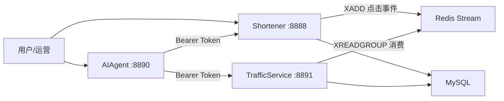

# Long2ShortAgent（中文说明）

Long2ShortAgent 是一个基于 Go 的多服务短链平台，包含：

- `Shortener`：短链核心服务（创建、更新、跳转）
- `TrafficService`：流量统计服务（PV/UV、来源、趋势）
- `AIAgent`：AI 编排服务（自然语言触发工具调用）

项目目标是把“短链管理 + 异步统计 + AI 编排”整合到一套可扩展架构中，并通过服务间鉴权与降级策略提升稳定性。

---

## 1. 架构概览



典型流程：
1. 用户自然语言请求进入 `AIAgent`  
2. 编排层调用 `Shortener` 创建/更新短链  
3. 用户访问短链时，`Shortener` 写入 Redis Stream 点击事件  
4. `TrafficService` 异步消费并聚合 PV/UV  
5. `AIAgent` 调用统计接口返回自然语言结果  

---

## 2. 仓库结构

```text
Long2ShortAgent/
├── Shortener/                  # 短链核心服务
│   ├── internal/
│   ├── model/
│   ├── sqlfile/
│   ├── deploy/docker-compose.yml
│   └── etc/shortener-api.yaml
├── TrafficService/             # 流量统计服务
│   ├── internal/
│   └── etc/traffic-service.yaml
├── AIAgent/                    # AI 编排服务
│   ├── internal/
│   ├── contracts/
│   ├── docs/
│   └── etc/ai-agent.yaml
├── contracts/                  # 事件契约
└── docs/                       # 架构文档
```

---

## 3. 核心功能

## 3.1 Shortener
- `POST /convert`：长链接转短链
- `GET /:shortUrl`：短链解析（并异步上报点击事件）
- `POST /internal/shortlinks`：内部创建短链
- `PATCH /internal/shortlinks/:shortCode`：内部更新短链
- 支持过期时间 `expireAt`
- 使用 MD5 去重和 Bloom Filter 防穿透

## 3.2 TrafficService
- 消费 Redis Stream 点击事件
- 落库明细表：`short_url_click_event`
- 聚合日统计表：`short_url_daily_stat`
- `GET /internal/traffic/shortlinks/:shortCode/summary`：返回 PV/UV、Top Referrer、趋势

## 3.3 AIAgent
- `POST /agent/execute`：编排入口
- `POST /agent/chat`：会话入口
- `POST /agent/chat/stream`：SSE 流式输出
- `GET /agent/tasks/:taskId`：任务详情
- 支持 `rule` 与 `eino` 两种执行策略
- 支持失败降级 `FallbackToRule=true`
- 支持会话记忆（短码、时间范围、过期时间）

---

## 4. 技术栈

- Go 1.25
- go-zero
- MySQL 8
- Redis 7（Bloom、Stream、Set）
- Eino（AI 工作流编排）

---

## 5. 本地快速启动

## 5.1 前置条件
- Go 1.25+
- Docker + Docker Compose
- 可用的 LLM API（AIAgent 使用）

## 5.2 启动基础依赖

```bash
cd Shortener/deploy
docker compose up -d
```

默认端口：
- MySQL: `127.0.0.1:3306`
- Redis: `127.0.0.1:6479`

## 5.3 初始化数据库

依次执行：
1. `Shortener/sqlfile/short_url_map.sql`
2. `Shortener/sqlfile/sequence.sql`
3. `Shortener/sqlfile/traffic.sql`

说明：当前短码发号默认使用 Redis `INCR`，`sequence` 表用于兼容。

## 5.4 修改配置

需要重点确认：
- 各服务 MySQL/Redis 地址
- `AIAgent` 到内部服务地址（8888/8891）
- `ServiceToken` 两端一致：
  - `Shortener/etc/shortener-api.yaml` -> `Internal.ServiceToken`
  - `AIAgent/etc/ai-agent.yaml` -> `InternalServices.ServiceToken`
- `AIAgent` 的 LLM 参数（`BaseURL/APIKey/Model`）

> 建议：不要使用默认 token 和示例 API key，启动前请替换。

## 5.5 启动服务

### 启动 Shortener
```bash
cd Shortener
go run shortener.go -f etc/shortener-api.yaml
```

### 启动 TrafficService
```bash
cd TrafficService
go run traffic.go -f etc/traffic-service.yaml
```

### 启动 AIAgent
```bash
cd AIAgent
go run agent.go -f etc/ai-agent.yaml
```

---

## 6. 常用接口示例

## 6.1 创建短链
```bash
curl -X POST http://127.0.0.1:8888/convert \
  -H "Content-Type: application/json" \
  -d '{"longUrl":"https://example.com/a/b"}'
```

## 6.2 内部创建（带 Bearer Token）
```bash
curl -X POST http://127.0.0.1:8888/internal/shortlinks \
  -H "Authorization: Bearer change-me" \
  -H "Content-Type: application/json" \
  -d '{
    "requestId":"req-1",
    "operatorId":"u1001",
    "tenantId":"t1001",
    "longUrl":"https://example.com/new"
  }'
```

## 6.3 内部更新（带 Bearer Token）
```bash
curl -X PATCH http://127.0.0.1:8888/internal/shortlinks/d \
  -H "Authorization: Bearer change-me" \
  -H "Content-Type: application/json" \
  -d '{
    "requestId":"req-2",
    "idempotencyKey":"idem-2",
    "operatorId":"u1001",
    "tenantId":"t1001",
    "expireAt":"2026-12-31 23:59:59"
  }'
```

## 6.4 查询流量汇总
```bash
curl "http://127.0.0.1:8891/internal/traffic/shortlinks/d/summary?from=2026-02-01&to=2026-02-11"
```

## 6.5 AI 编排执行
```bash
curl -X POST http://127.0.0.1:8890/agent/execute \
  -H "Content-Type: application/json" \
  -d '{
    "requestId":"exec-001",
    "operatorId":"u1001",
    "tenantId":"t1001",
    "idempotencyKey":"idem-001",
    "query":"把短链 d 的过期时间改到 2026-12-31 23:59:59 并查询近7天流量",
    "context":{"shortUrl":"d","from":"2026-02-05","to":"2026-02-11","expireAt":"2026-12-31 23:59:59"}
  }'
```

---

## 7. 服务间鉴权（Bearer Token）

内部写接口采用服务间 Bearer Token：
1. `AIAgent` 调用时设置 `Authorization: Bearer <token>`  
2. `Shortener` 在 handler 入口校验 token  
3. 校验失败直接返回 `401 unauthorized`  
4. 校验通过后才执行创建/更新逻辑  

---

## 8. 测试与调试

## 8.1 运行测试
```bash
cd Shortener && go test ./...
cd ../TrafficService && go test ./...
cd ../AIAgent && go test ./...
```

## 8.2 AIAgent CLI
```bash
cd AIAgent
./chat --tools --session demo-cli-1
```

---

## 9. 常见问题

### Q1: 内部接口返回 401
- 检查 `ServiceToken` 两端是否一致。

### Q2: 流量查询一直为 0
- 确认访问过 `GET /:shortUrl`，因为点击事件在该链路上报。
- 检查 Redis Stream 名称配置是否一致。

### Q3: Chat 有回复但不触发工具
- 检查 `enableTools=true`。
- 检查内部服务地址和 token。
- 检查 `Orchestration.Engine` 与 `FallbackToRule`。

---

## 10. 相关文档

- `docs/microservice-ai-blueprint.md`
- `AIAgent/README.md`
- `AIAgent/contracts/tool-contracts.md`
- `contracts/click-event.json`

